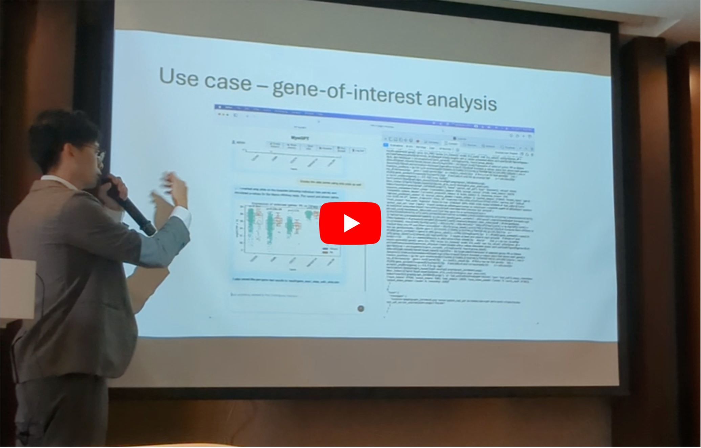

# MyeGPT

An agentic conversation application for researchers to mine the MMRF-CoMMpass dataset, built with LangChain.

It aims to accelerate hypothesis generation among wet-lab researchers by giving access to clinical cohort data at their fingertips.

# Demonstration

1. Gene expression heatmap

https://github.com/user-attachments/assets/900501d4-bd6b-4141-9ab6-42817acabeaf

2. Survival regression

https://github.com/user-attachments/assets/e8aaf750-44ea-4f4d-8774-a7ce8f1f8039

# Compatibility

MyeGPT is intended for desktop use but also works on smartphones i.e. devices with viewport width < 768px

Supported browsers: Chrome, Firefox, Safari

| Browser | Brave | Chrome | Edge | Firefox | Opera | Safari |
|---|---|---|---|---|---|---|
| Compatibility | ❌ | ✅️ | ❌ | ✅️ | ❌ | ✅️ |

# Publicity

Best oral presentation in the Youth Forum for ICBBS 2025 at Xiamen, 18 October.

# Acknowledgements
- Multiple Myeloma Research Foundation (MMRF) 
- Participants of the CoMMpass trial (NCT01454297)
- Prof Chng Wee Joo, CSI, NUS for research funding

# License
- This project is open source under [Dual Licensing](LICENSE.md)
